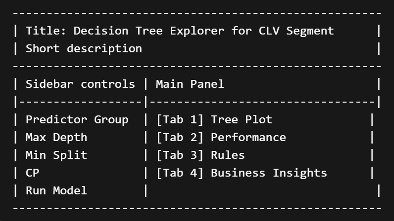

## 5. UI Design and Storyboard

### 5.1 Intended Users

This prototype is designed for multiple types of users:

-   instructors evaluating the technical and visual design quality
-   classmates and project teammates
-   general business users
-   non-technical stakeholders who need interpretable insights

Therefore, the UI is designed to be **simple, structured, and exploration-oriented**.

------------------------------------------------------------------------

### 5.2 Layout Structure



The proposed Shiny layout consists of **two main areas**.

#### Left Sidebar

The sidebar contains user controls such as:

-   predictor group selection\
-   maximum tree depth\
-   minimum split size\
-   complexity parameter\
-   train-test ratio\
-   optional data filters (e.g., gender or income group)

#### Main Panel

The main area contains **tabbed outputs**, including:

-   **Tree Plot**
-   **Performance**
-   **Rules**
-   **Data Preview**
-   **Business Insights**

This layout supports an intuitive workflow: users first control the model settings and then inspect the analytical outputs from multiple perspectives.

------------------------------------------------------------------------

### 5.3 Interaction Flow

The intended user interaction sequence is:

1.  The user selects a predictor group.\
2.  The user adjusts tree complexity settings.\
3.  The system fits the decision tree model.\
4.  The tree plot and performance metrics are updated.\
5.  The user reviews the resulting rules and business insights.

This sequence is designed to **encourage exploration rather than passive viewing**.

------------------------------------------------------------------------

### 5.4 Storyboard Description

#### Screen 1: Initial Dashboard

The dashboard opens with a **title, a short module description, and a default tree plot**.\
The sidebar displays all control settings.

#### Screen 2: Parameter Tuning

The user changes **tree depth and complexity settings**.\
The tree is regenerated, allowing comparison between **simpler and more detailed decision structures**.

#### Screen 3: Performance Review

The user switches to the **Performance tab** to review **confusion matrix results** and determine whether the current tree is sufficiently effective.

#### Screen 4: Rule Interpretation

The user opens the **Rules tab** and examines **terminal node summaries or extracted if-then logic** for business interpretation.

#### Screen 5: Business Insights

The user reads a short textual summary that translates **model patterns into practical managerial insights**.

------------------------------------------------------------------------

### 5.5 Why This UI Design Is Appropriate

This UI design is suitable because it balances:

-   analytical depth
-   visual clarity
-   user control
-   interpretability

Instead of overwhelming users with too many outputs at once, the **tab-based layout separates analytical tasks into manageable views**.

This makes the module more usable and better aligned with the purpose of **visual analytics**.

## 6. Simplified Code Example For **R Shiny Application**

```{r}
#| eval: false

library(shiny)
library(rpart)
library(rpart.plot)
library(DT)

ui <- fluidPage(
  titlePanel("Decision Tree Explorer for CLV Segment"),
  
  sidebarLayout(
    sidebarPanel(
      h4("Model Controls"),
      
      selectInput(
        "predictor_group",
        "Predictor Group",
        choices = c("All Variables", "Demographics", "Behavior", "Satisfaction"),
        selected = "All Variables"
      ),
      
      sliderInput(
        "maxdepth",
        "Maximum Tree Depth",
        min = 2, max = 6, value = 4
      ),
      
      sliderInput(
        "minsplit",
        "Minimum Split",
        min = 10, max = 100, value = 30, step = 5
      ),
      
      sliderInput(
        "cp",
        "Complexity Parameter",
        min = 0.001, max = 0.05, value = 0.01, step = 0.001
      ),
      
      actionButton("run_model", "Run Model")
    ),
    
    mainPanel(
      tabsetPanel(
        tabPanel(
          "Tree Plot",
          br(),
          plotOutput("tree_plot", height = "600px")
        ),
        
        tabPanel(
          "Performance",
          br(),
          verbatimTextOutput("model_perf")
        ),
        
        tabPanel(
          "Rules",
          br(),
          DTOutput("rules_table")
        ),
        
        tabPanel(
          "Business Insights",
          br(),
          htmlOutput("insights_text")
        )
      )
    )
  )
)

server <- function(input, output, session) {
  
  # iris for demo
  # train_data for real data
  
  model_result <- eventReactive(input$run_model, {
    
    demo_data <- iris
    demo_data$Species <- as.factor(demo_data$Species)
    
    fit <- rpart(
      Species ~ .,
      data = demo_data,
      method = "class",
      control = rpart.control(
        maxdepth = input$maxdepth,
        minsplit = input$minsplit,
        cp = input$cp
      )
    )
    
    list(
      model = fit,
      frame = fit$frame
    )
  })
  
  output$tree_plot <- renderPlot({
    req(model_result())
    
    rpart.plot(
      model_result()$model,
      type = 2,
      extra = 104,
      fallen.leaves = TRUE,
      box.palette = "GnBu"
    )
  })
  
  output$model_perf <- renderPrint({
    req(model_result())
    
    print(summary(model_result()$model))
  })
  
  output$rules_table <- renderDT({
    req(model_result())
    
    leaf_nodes <- data.frame(
      node = rownames(model_result()$frame),
      split_variable = model_result()$frame$var,
      sample_size = model_result()$frame$n,
      predicted_class = model_result()$frame$yval
    )
    
    datatable(leaf_nodes, options = list(pageLength = 5))
  })
  
  output$insights_text <- renderUI({
    req(model_result())
    
    HTML("
      <h4>Business Interpretation</h4>
      <ul>
        <li>The model identifies the most important variables that separate customer groups.</li>
        <li>Users can compare simpler versus more complex trees by adjusting model parameters.</li>
        <li>The final application will convert terminal nodes into clearer if-then business rules.</li>
      </ul>
    ")
  })
}

shinyApp(ui = ui, server = server)
```
